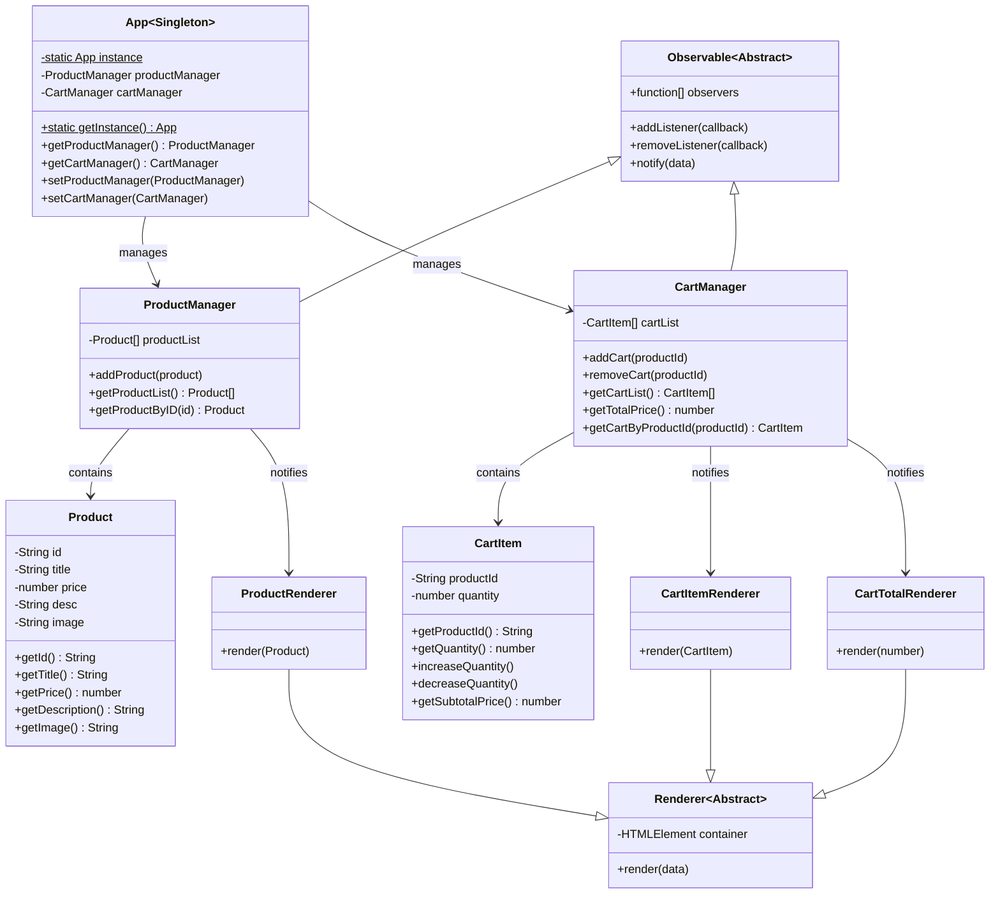

# Mid Term - Fake Store
We would appreciate it if you could take a look at the [`CONTRIBUTING.md`](./CONTRIBUTING.md) as well.

## Description

In this project, we've built a fake shop using OOP. We also have created classes for each entity and use them to create the shop.

We referred to [`index.static.html`](./index.static.html) and [DEMO video](https://www.loom.com/share/26304f8a106b460e82dbe7707201b776?sid=13d15206-ca50-4342-bd39-c2d86978c408) to get familiar with UI.

## Features

- Fetch the products from the [`db.json`](./server/db.json)
- Display the list of products that can be added to cart 
- Display the Cart summary with total price 
- Display either the list of items in the cart or placeholder when cart is empty 
- Press the `Quick Add` button to add item to the cart and increase quantity 
- Press the `Remove` button to remove item from cart and decrease quantity 
- Display the Total Price gets updated as cart items change

## Class diagram


## Installation

Clone the project

```bash
  git clone https://github.com/M-0923/wad203-mid-term-project-fake-store-snowperson.git
```

Navigate to the project directory

```bash
  cd wad203-mid-term-project-fake-store-snowperson
```

Install dependencies

```bash
  npm install
```

Start the vite & json server

```bash
  npm run dev
```

## Authors
- Akio ([@akiomatic](https://www.github.com/akiomatic))
- Kai ([@KaiKoide](https://www.github.com/KaiKoide))